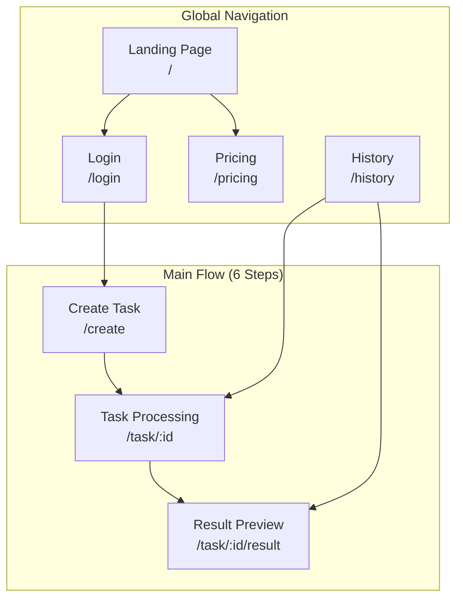

# 探店宝 (Shop Video Scout) UI/UX Specification

---

## 1. Introduction

This document defines the user experience goals, information architecture, user flows, and visual design specifications for **探店宝 (Shop Video Scout)**'s user interface. It serves as the foundation for visual design and frontend development, ensuring a cohesive and user-centered experience.

### 1.1 Change Log

| Date | Version | Description | Author |
|------|---------|-------------|--------|
| 2026-01-17 | 1.0 | Initial UI/UX Specification | UX Expert (Jingwen) |

---

## 2. Overall UX Goals & Principles

### 2.1 Target User Personas

| Persona | Description | Primary Goals | Pain Points |
|---------|-------------|---------------|-------------|
| **探店新手** | 刚开始做探店内容的创作者，缺乏视频剪辑经验，核心需求是"一键出片" | 快速产出可发布的视频，降低学习成本 | 不会剪辑、不知如何写文案、配音困难 |
| **探店达人** | 有粉丝基础的内容创作者，追求效率和个性化（声音克隆），高频用户 | 提升产出效率、保持个人风格 | 素材处理耗时、重复性工作多 |

### 2.2 Usability Goals

| Goal | Description |
|------|-------------|
| **Minimal Learning Curve** | 无视频剪辑经验的用户可按引导完成首次出片 |
| **Processing Transparency** | 用户始终了解AI处理进度和预计时间 |
| **Reversible Actions** | 关键步骤支持返回修改和重新生成 |
| **Accessible by Default** | 符合WCAG AA标准，支持键盘导航和屏幕阅读器 |

### 2.3 Design Principles

1. **步骤引导 > 自由探索** — 将复杂流程拆解为6个清晰步骤，引导用户线性完成
2. **实时反馈 > 静默处理** — 每个AI处理阶段都有进度可视化，减少等待焦虑
3. **渐进披露** — 核心功能前置，高级功能（声音克隆）以可选入口呈现
4. **即时预览** — 脚本、配音、视频均支持预览后再确认
5. **一键操作** — 下载、复制、发布辅助都追求最少点击数

---

## 3. Information Architecture (IA)

### 3.1 Site Map



### 3.2 Screen Inventory

| # | Screen | Route | Purpose | Auth Required |
|---|--------|-------|---------|---------------|
| 1 | 首页/落地页 | `/` | 产品介绍、快速开始入口、价值主张 | No |
| 2 | 登录页 | `/login` | 手机号验证码登录 | No |
| 3 | 定价页 | `/pricing` | 套餐和价格展示 | No |
| 4 | 创建任务页 | `/create` | Step 1-2: 店铺信息 + 视频上传 | Yes |
| 5 | 任务处理页 | `/task/:id` | Step 3-5: AI分析 → 脚本编辑 → 配音设置 | Yes |
| 6 | 结果预览页 | `/task/:id/result` | Step 6: 视频预览 + 下载 + 发布辅助 | Yes |
| 7 | 历史任务页 | `/history` | 历史任务列表管理 | Yes |

### 3.3 Navigation Structure

**Primary Navigation (Header):**
```
[Logo: 探店宝] -------- [创建视频] [历史任务] [定价] -------- [用户头像 ▼]
                                                              ├─ 我的账户
                                                              ├─ 我的声音
                                                              └─ 退出登录
```

**Secondary Navigation (Task Flow - Step Indicator):**
```
[1. 填写信息] → [2. 上传视频] → [3. AI分析] → [4. 编辑脚本] → [5. 配音设置] → [6. 预览导出]
     ●              ●              ○              ○              ○              ○
   完成            进行中
```

**Breadcrumb Strategy:**
- Not used in main task flow (step indicator serves this purpose)
- Used in account/settings pages: `首页 > 我的账户 > 我的声音`

### 3.4 Page State Mapping

| Screen | States |
|--------|--------|
| `/create` | Empty → Filling → Uploading → Ready |
| `/task/:id` | Analyzing → Script Ready → Editing → Composing → Complete |
| `/task/:id/result` | Loading → Ready → Downloading |
| `/history` | Empty → Loading → Loaded → Error |

---

## 4. User Flows

### 4.1 Main Flow: 一键出片主流程

**User Goal:** 将探店素材转化为可发布的成品视频

**Entry Points:**
- Landing page "开始创作" CTA
- Header "创建视频" button
- History page "新建任务" button

**Success Criteria:**
- User downloads finished video
- User copies hashtags/title for publishing

#### Flow Diagram

```mermaid
flowchart TD
    START([用户点击创建视频]) --> AUTH{已登录?}
    AUTH -->|No| LOGIN[跳转登录页]
    LOGIN --> AUTH
    AUTH -->|Yes| STEP1[Step 1: 填写店铺信息]

    STEP1 --> V1{表单验证}
    V1 -->|失败| STEP1
    V1 -->|通过| STEP2[Step 2: 上传视频]

    STEP2 --> UPLOAD[拖拽/选择视频文件]
    UPLOAD --> PROGRESS[显示上传进度]
    PROGRESS --> V2{10-20个视频?}
    V2 -->|不足| UPLOAD
    V2 -->|通过| ANALYZE_BTN[点击"开始AI分析"]

    ANALYZE_BTN --> STEP3[Step 3: AI镜头分析]
    STEP3 --> AI_PROGRESS[显示分析进度 ~3分钟]
    AI_PROGRESS --> STEP4[Step 4: 脚本生成与编辑]

    STEP4 --> SCRIPT_VIEW[查看AI生成脚本]
    SCRIPT_VIEW --> EDIT_DECISION{满意?}
    EDIT_DECISION -->|编辑| EDIT_SCRIPT[手动修改脚本]
    EDIT_SCRIPT --> SAVE_SCRIPT[保存修改]
    SAVE_SCRIPT --> EDIT_DECISION
    EDIT_DECISION -->|重新生成| REGEN[调用AI重新生成]
    REGEN --> SCRIPT_VIEW
    EDIT_DECISION -->|确认| STEP5[Step 5: 配音设置]

    STEP5 --> VOICE_SELECT[选择音色]
    VOICE_SELECT --> PREVIEW_VOICE[试听配音效果]
    PREVIEW_VOICE --> VOICE_OK{满意?}
    VOICE_OK -->|换音色| VOICE_SELECT
    VOICE_OK -->|克隆声音| CLONE_FLOW[声音克隆子流程]
    CLONE_FLOW --> VOICE_SELECT
    VOICE_OK -->|确认| SUBTITLE_SET[字幕设置]

    SUBTITLE_SET --> SUB_TOGGLE{开启字幕?}
    SUB_TOGGLE -->|Yes| STYLE_SELECT[选择字幕样式]
    STYLE_SELECT --> COMPOSE_BTN[点击"生成视频"]
    SUB_TOGGLE -->|No| COMPOSE_BTN

    COMPOSE_BTN --> COMPOSE[配音合成+视频剪辑 ~5-8分钟]
    COMPOSE --> STEP6[Step 6: 预览与导出]

    STEP6 --> PREVIEW[预览成品视频]
    PREVIEW --> SATISFIED{满意?}
    SATISFIED -->|No| BACK_EDIT[返回修改脚本]
    BACK_EDIT --> STEP4
    SATISFIED -->|Yes| DOWNLOAD[下载成品视频]

    DOWNLOAD --> PUBLISH_ASSIST[查看发布辅助]
    PUBLISH_ASSIST --> COPY_TAGS[复制话题标签]
    PUBLISH_ASSIST --> COPY_TITLE[复制推荐标题]

    COPY_TAGS --> SUCCESS([完成])
    COPY_TITLE --> SUCCESS
    DOWNLOAD --> SUCCESS
```

#### Edge Cases & Error Handling

| Scenario | Handling |
|----------|----------|
| 上传中断/网络失败 | 自动重试3次，失败后显示"重新上传"按钮，已上传文件保留 |
| AI分析超时 | 显示"分析时间较长，请耐心等待"，超过5分钟显示重试选项 |
| 脚本重新生成次数超限(5次) | 禁用重新生成按钮，提示"请手动编辑调整" |
| 视频合成失败 | 自动重试2次，失败后显示客服联系方式 |
| 页面意外关闭 | 任务状态保存，用户可从历史任务继续 |
| 声音克隆处理中 | 允许使用标准音色先完成，克隆完成后可重新生成 |

#### Time Budget

| Step | Expected Duration | User Action |
|------|-------------------|-------------|
| Step 1: 填写信息 | 1-2 min | Active input |
| Step 2: 上传视频 | 2-5 min | Wait (upload progress visible) |
| Step 3: AI分析 | ~3 min | Wait (progress bar) |
| Step 4: 脚本编辑 | 1-3 min | Active review/edit |
| Step 5: 配音设置 | 1-2 min | Active selection |
| Step 6: 视频合成 | 5-8 min | Wait (progress bar) |
| **Total** | **13-23 min** | ~5 min active, rest is wait time |

---

### 4.2 Sub-Flow: 声音克隆流程

**User Goal:** 使用自己的声音为视频配音，增加个人特色

**Entry Points:**
- Step 5 配音设置页 → "使用我的声音" / "上传声音样本"
- 用户头像菜单 → "我的声音"

**Success Criteria:**
- Voice sample successfully cloned
- User can select cloned voice for dubbing

#### Flow Diagram

```mermaid
flowchart TD
    START([用户点击"上传声音样本"]) --> CHECK_LIMIT{已有样本数 < 3?}

    CHECK_LIMIT -->|No, 已满| MANAGE[显示"管理我的声音"<br/>删除旧样本后再上传]
    MANAGE --> DELETE_SAMPLE[删除一个旧样本]
    DELETE_SAMPLE --> CHECK_LIMIT

    CHECK_LIMIT -->|Yes| MODAL[打开声音克隆弹窗]

    MODAL --> INSTRUCTIONS[显示上传要求说明]

    INSTRUCTIONS --> UPLOAD_METHOD{选择上传方式}

    UPLOAD_METHOD -->|选择文件| FILE_SELECT[从设备选择音频文件]
    UPLOAD_METHOD -->|在线录音| RECORD_START[开始录音]

    RECORD_START --> RECORDING[录音中... 显示时长]
    RECORDING --> RECORD_STOP[停止录音]
    RECORD_STOP --> RECORD_PREVIEW[试听录音]
    RECORD_PREVIEW --> RECORD_OK{满意?}
    RECORD_OK -->|重录| RECORD_START
    RECORD_OK -->|确认| VALIDATE

    FILE_SELECT --> VALIDATE{验证文件}

    VALIDATE -->|格式错误| ERR_FORMAT[提示: 仅支持MP3/WAV/M4A]
    ERR_FORMAT --> UPLOAD_METHOD

    VALIDATE -->|时长不符| ERR_DURATION[提示: 时长需30秒-2分钟]
    ERR_DURATION --> UPLOAD_METHOD

    VALIDATE -->|通过| UPLOAD[上传音频文件]

    UPLOAD --> UPLOAD_PROGRESS[显示上传进度]
    UPLOAD_PROGRESS --> UPLOAD_FAIL{上传成功?}
    UPLOAD_FAIL -->|失败| RETRY_UPLOAD[显示重试按钮]
    RETRY_UPLOAD --> UPLOAD

    UPLOAD_FAIL -->|成功| CLONE_START[开始声音克隆处理]

    CLONE_START --> CLONE_PROGRESS[显示克隆进度<br/>预计3-5分钟]

    CLONE_PROGRESS --> CLONE_STATUS{克隆状态}

    CLONE_STATUS -->|处理中| WAIT_OPTIONS[显示等待选项]

    WAIT_OPTIONS -->|继续等待| CLONE_PROGRESS
    WAIT_OPTIONS -->|先用标准音色| CLOSE_USE_STD[关闭弹窗<br/>返回配音设置]
    WAIT_OPTIONS -->|稍后查看| CLOSE_LATER[关闭弹窗<br/>后台继续处理]

    CLONE_STATUS -->|失败| CLONE_FAIL[显示失败原因]

    CLONE_FAIL --> RETRY_OR_NEW{选择}
    RETRY_OR_NEW -->|重新上传| UPLOAD_METHOD
    RETRY_OR_NEW -->|取消| CANCEL[关闭弹窗]

    CLONE_STATUS -->|成功| CLONE_SUCCESS[克隆成功!]
    CLONE_SUCCESS --> PREVIEW_CLONE[试听克隆效果]
    PREVIEW_CLONE --> USE_CLONE[自动选中新声音<br/>关闭弹窗]

    USE_CLONE --> END([返回配音设置<br/>已选中"我的声音"])
    CLOSE_USE_STD --> END2([返回配音设置<br/>选中标准音色])
    CLOSE_LATER --> END3([返回配音设置<br/>显示"克隆中"状态])
```

#### Upload Requirements

| Requirement | Value |
|-------------|-------|
| 时长 | 30秒 - 2分钟 |
| 格式 | MP3 / WAV / M4A |
| 内容 | 清晰朗读，无背景噪音 |
| 最大样本数 | 每用户3个 |

#### Edge Cases & Error Handling

| Scenario | Handling | User Message |
|----------|----------|--------------|
| 样本数量已满(3个) | 引导用户删除旧样本 | "您已有3个声音样本，请删除一个后再上传" |
| 音频时长不足30秒 | 阻止上传，显示当前时长 | "声音样本需要30秒以上，当前仅XX秒" |
| 音频时长超过2分钟 | 阻止上传，建议裁剪 | "声音样本最长2分钟，请裁剪后重新上传" |
| 克隆失败-噪音 | 提示原因，建议重录 | "音频背景噪音较大，建议在安静环境重新录制" |
| 克隆失败-服务 | 自动重试，失败后提示 | "服务暂时繁忙，请稍后重试" |
| 克隆中关闭页面 | 后台继续，下次显示状态 | 返回时显示"克隆中..."状态 |

---

## 5. Wireframes & Key Screen Layouts

### 5.1 首页/落地页 (`/`)

```
┌─────────────────────────────────────────────────────────────────┐
│  [Logo: 探店宝]          [创建视频] [历史任务] [定价] [登录]    │
├─────────────────────────────────────────────────────────────────┤
│                                                                 │
│                    🎬 探店达人的AI视频助手                       │
│                                                                 │
│              上传素材 → AI分析 → 自动剪辑 → 一键出片              │
│                                                                 │
│                    [ 🚀 免费开始创作 ]                           │
│                                                                 │
├─────────────────────────────────────────────────────────────────┤
│                                                                 │
│   ┌─────────────┐  ┌─────────────┐  ┌─────────────┐            │
│   │  📤 上传    │  │  🤖 AI分析  │  │  🎬 出片    │            │
│   │  拖拽上传   │  │  智能筛选   │  │  一键下载   │            │
│   │  10-20个   │  │  自动分类   │  │  带配音字幕 │            │
│   └─────────────┘  └─────────────┘  └─────────────┘            │
│                                                                 │
├─────────────────────────────────────────────────────────────────┤
│                        🎥 效果展示                               │
│   ┌───────────────────────────────────────────────────────┐    │
│   │                   [视频播放器]                         │    │
│   │                   示例成品视频                          │    │
│   └───────────────────────────────────────────────────────┘    │
│                                                                 │
└─────────────────────────────────────────────────────────────────┘
```

### 5.2 创建任务页 - Step 1 店铺信息 (`/create`)

```
┌─────────────────────────────────────────────────────────────────┐
│  [Logo]              创建探店视频              [用户头像 ▼]      │
├─────────────────────────────────────────────────────────────────┤
│                                                                 │
│  ┌─ Step Indicator ─────────────────────────────────────────┐  │
│  │ [1.填写信息]●──[2.上传视频]○──[3.AI分析]○──[4.脚本]○──... │  │
│  └──────────────────────────────────────────────────────────┘  │
│                                                                 │
│  ┌─ 店铺信息 ───────────────────────────────────────────────┐  │
│  │                                                           │  │
│  │  店铺名称 *                                               │  │
│  │  ┌─────────────────────────────────────────────────────┐ │  │
│  │  │ 海底捞火锅(望京店)                                   │ │  │
│  │  └─────────────────────────────────────────────────────┘ │  │
│  │                                                           │  │
│  │  店铺类型 *                                               │  │
│  │  (●) 餐饮美食  ( ) 美容美发  ( ) 休闲娱乐  ( ) 其他       │  │
│  │                                                           │  │
│  │  商品/优惠描述 (选填)                                     │  │
│  │  ┌─────────────────────────────────────────────────────┐ │  │
│  │  │ 人均89，招牌毛肚七上八下，新人9.9元锅底...          │ │  │
│  │  └─────────────────────────────────────────────────────┘ │  │
│  │                                                    0/500  │  │
│  │                                                           │  │
│  │  视频风格 *                                               │  │
│  │  ┌───────────┐ ┌───────────┐ ┌───────────┐              │  │
│  │  │ 🌟 种草   │ │ 📝 测评   │ │ 📷 Vlog   │              │  │
│  │  │ 安利型   │ │ 真实型    │ │ 探店型    │              │  │
│  │  │    ✓     │ │           │ │           │              │  │
│  │  └───────────┘ └───────────┘ └───────────┘              │  │
│  │                                                           │  │
│  └───────────────────────────────────────────────────────────┘  │
│                                                                 │
│                                         [ 下一步：上传视频 → ] │
│                                                                 │
└─────────────────────────────────────────────────────────────────┘
```

### 5.3 创建任务页 - Step 2 上传视频 (`/create`)

```
┌─────────────────────────────────────────────────────────────────┐
│  [Logo]              创建探店视频              [用户头像 ▼]      │
├─────────────────────────────────────────────────────────────────┤
│                                                                 │
│  ┌─ Step Indicator ─────────────────────────────────────────┐  │
│  │ [1.填写信息]✓──[2.上传视频]●──[3.AI分析]○──[4.脚本]○──... │  │
│  └──────────────────────────────────────────────────────────┘  │
│                                                                 │
│  ┌─ 上传探店视频 ───────────────────────────────────────────┐  │
│  │                                                           │  │
│  │  ┌╌╌╌╌╌╌╌╌╌╌╌╌╌╌╌╌╌╌╌╌╌╌╌╌╌╌╌╌╌╌╌╌╌╌╌╌╌╌╌╌╌╌╌╌╌╌╌╌╌╌╌┐ │  │
│  │  ┆                                                     ┆ │  │
│  │  ┆           📁 拖拽视频文件到此处                      ┆ │  │
│  │  ┆              或 [点击选择文件]                       ┆ │  │
│  │  ┆                                                     ┆ │  │
│  │  ┆        支持 MP4/MOV，单个≤100MB，≤3分钟             ┆ │  │
│  │  ┆                                                     ┆ │  │
│  │  └╌╌╌╌╌╌╌╌╌╌╌╌╌╌╌╌╌╌╌╌╌╌╌╌╌╌╌╌╌╌╌╌╌╌╌╌╌╌╌╌╌╌╌╌╌╌╌╌╌╌╌┘ │  │
│  │                                                           │  │
│  │  已上传: 12/20 (需要10-20个视频)                          │  │
│  │  ┌────┐ ┌────┐ ┌────┐ ┌────┐ ┌────┐ ┌────┐              │  │
│  │  │ 🖼 │ │ 🖼 │ │ 🖼 │ │ 🖼 │ │ 🖼 │ │ 🖼 │              │  │
│  │  │ ✓  │ │ ✓  │ │ ✓  │ │ ✓  │ │ ✓  │ │ ✓  │              │  │
│  │  │ 45s│ │ 32s│ │ 28s│ │ 1m │ │ 55s│ │ 40s│              │  │
│  │  └────┘ └────┘ └────┘ └────┘ └────┘ └────┘              │  │
│  │                                                           │  │
│  └───────────────────────────────────────────────────────────┘  │
│                                                                 │
│  [ ← 返回修改信息 ]                    [ 开始AI分析 → ]        │
│                                                                 │
└─────────────────────────────────────────────────────────────────┘
```

### 5.4 任务处理页 - AI分析进度 (`/task/:id`)

```
┌─────────────────────────────────────────────────────────────────┐
│  [Logo]              探店视频制作中              [用户头像 ▼]   │
├─────────────────────────────────────────────────────────────────┤
│                                                                 │
│  ┌─ Step Indicator ─────────────────────────────────────────┐  │
│  │ [1.填写信息]✓──[2.上传视频]✓──[3.AI分析]●──[4.脚本]○──... │  │
│  └──────────────────────────────────────────────────────────┘  │
│                                                                 │
│  ┌─────────────────────────────────────────────────────────────┐│
│  │                                                             ││
│  │                    🤖 AI正在分析您的视频                     ││
│  │                                                             ││
│  │         ████████████████████░░░░░░░░░░  65%                ││
│  │                                                             ││
│  │                   已分析 13/20 个视频                        ││
│  │                   预计剩余时间: 1分钟                        ││
│  │                                                             ││
│  │  ┌─────────────────────────────────────────────────────┐   ││
│  │  │  ✓ 镜头内容识别完成                                  │   ││
│  │  │  ✓ 画面质量评估完成                                  │   ││
│  │  │  ● 推荐镜头标记中...                                 │   ││
│  │  │  ○ 脚本生成                                          │   ││
│  │  └─────────────────────────────────────────────────────┘   ││
│  │                                                             ││
│  │              💡 小贴士：AI会自动筛选最佳镜头                  ││
│  │                                                             ││
│  └─────────────────────────────────────────────────────────────┘│
│                                                                 │
└─────────────────────────────────────────────────────────────────┘
```

### 5.5 任务处理页 - 脚本编辑 (`/task/:id`)

```
┌─────────────────────────────────────────────────────────────────┐
│  [Logo]              探店视频制作中              [用户头像 ▼]   │
├─────────────────────────────────────────────────────────────────┤
│                                                                 │
│  ┌─ Step Indicator ─────────────────────────────────────────┐  │
│  │ [1]✓──[2]✓──[3]✓──[4.编辑脚本]●──[5.配音设置]○──[6]○     │  │
│  └──────────────────────────────────────────────────────────┘  │
│                                                                 │
│  ┌─ 左侧：镜头预览 ─────────┐  ┌─ 右侧：脚本编辑 ───────────┐  │
│  │                          │  │                            │  │
│  │  推荐镜头 (8个)          │  │  📝 口播脚本               │  │
│  │  ┌────┐ ┌────┐          │  │  ┌────────────────────────┐│  │
│  │  │🖼⭐│ │🖼⭐│ 食物(2)   │  │  │【开场】               ││  │
│  │  └────┘ └────┘          │  │  │对应镜头: 达人出镜#1    ││  │
│  │  ┌────┐ ┌────┐          │  │  │                        ││  │
│  │  │🖼⭐│ │🖼⭐│ 环境(2)   │  │  │"家人们！今天给你们探  ││  │
│  │  └────┘ └────┘          │  │  │ 一家望京超火的海底捞..." ││  │
│  │  ┌────┐ ┌────┐          │  │  │                   [编辑]││  │
│  │  │🖼⭐│ │🖼⭐│ 人物(2)   │  │  └────────────────────────┘│  │
│  │  └────┘ └────┘          │  │                            │  │
│  │  ┌────┐ ┌────┐          │  │  ... (更多段落)            │  │
│  │  │🖼⭐│ │🖼⭐│ 其他(2)   │  │                            │  │
│  │  └────┘ └────┘          │  │  [🔄 重新生成] 剩余4次     │  │
│  │                          │  │                            │  │
│  │  ⭐ = AI推荐             │  │                            │  │
│  └──────────────────────────┘  └────────────────────────────┘  │
│                                                                 │
│  [ ← 返回 ]                              [ 下一步：配音设置 → ]│
│                                                                 │
└─────────────────────────────────────────────────────────────────┘
```

### 5.6 任务处理页 - 配音设置 (`/task/:id`)

```
┌─────────────────────────────────────────────────────────────────┐
│  [Logo]              探店视频制作中              [用户头像 ▼]   │
├─────────────────────────────────────────────────────────────────┤
│                                                                 │
│  ┌─ Step Indicator ─────────────────────────────────────────┐  │
│  │ [1]✓──[2]✓──[3]✓──[4]✓──[5.配音设置]●──[6.预览导出]○     │  │
│  └──────────────────────────────────────────────────────────┘  │
│                                                                 │
│  ┌─ 配音音色 ───────────────────────────────────────────────┐  │
│  │                                                           │  │
│  │  标准音色                                                 │  │
│  │  ┌─────────────┐ ┌─────────────┐ ┌─────────────┐         │  │
│  │  │ 👩 活泼女声 │ │ 👨 阳光男声 │ │ 👩‍💼 知性女声 │         │  │
│  │  │   xiaomei   │ │  xiaoshuai  │ │   xiaoya    │         │  │
│  │  │  [▶ 试听]  │ │  [▶ 试听]  │ │  [▶ 试听]  │         │  │
│  │  │     ✓      │ │             │ │             │         │  │
│  │  └─────────────┘ └─────────────┘ └─────────────┘         │  │
│  │                                                           │  │
│  │  我的声音                                                 │  │
│  │  ┌─────────────┐ ┌─────────────┐                         │  │
│  │  │ 🎤 声音1   │ │ ＋ 上传新   │                         │  │
│  │  │ [▶ 试听]  │ │ 声音样本   │                         │  │
│  │  └─────────────┘ └─────────────┘                         │  │
│  │                                                           │  │
│  └───────────────────────────────────────────────────────────┘  │
│                                                                 │
│  ┌─ 字幕设置 ───────────────────────────────────────────────┐  │
│  │                                                           │  │
│  │  字幕开关  [====●]  为视频添加字幕                        │  │
│  │                                                           │  │
│  │  字幕样式                                                 │  │
│  │  ┌────────┐ ┌────────┐ ┌────────┐ ┌────────┐ ┌────────┐ │  │
│  │  │ 简约   │ │ 活力   │ │ 小红书 │ │ 抖音   │ │ 霓虹   │ │  │
│  │  │ 白字   │ │ 黄字   │ │  风    │ │ 热门   │ │ 炫彩   │ │  │
│  │  │   ✓   │ │        │ │        │ │        │ │        │ │  │
│  │  └────────┘ └────────┘ └────────┘ └────────┘ └────────┘ │  │
│  │                                                           │  │
│  └───────────────────────────────────────────────────────────┘  │
│                                                                 │
│  [ ← 返回编辑脚本 ]                        [ 🎬 生成视频 → ]   │
│                                                                 │
└─────────────────────────────────────────────────────────────────┘
```

### 5.7 结果预览页 (`/task/:id/result`)

```
┌─────────────────────────────────────────────────────────────────┐
│  [Logo]              视频制作完成 🎉            [用户头像 ▼]   │
├─────────────────────────────────────────────────────────────────┤
│                                                                 │
│  ┌─ Step Indicator ─────────────────────────────────────────┐  │
│  │ [1]✓──[2]✓──[3]✓──[4]✓──[5]✓──[6.预览导出]●              │  │
│  └──────────────────────────────────────────────────────────┘  │
│                                                                 │
│  ┌─ 左侧：视频预览 ─────────┐  ┌─ 右侧：发布辅助 ───────────┐  │
│  │  ┌─────────────────────┐ │  │                            │  │
│  │  │                     │ │  │  📥 下载                   │  │
│  │  │    🎬 视频播放器     │ │  │  [ 下载成品视频 ]          │  │
│  │  │      1080x1920      │ │  │  [ 下载素材包 ]           │  │
│  │  │                     │ │  │                            │  │
│  │  │  ▶  ━━━━━●━━━  1:02 │ │  │  ──────────────────────    │  │
│  │  └─────────────────────┘ │  │                            │  │
│  │                          │  │  🏷️ 推荐话题              │  │
│  │  📊 视频信息             │  │  #海底捞 #火锅探店         │  │
│  │  分辨率: 1080x1920       │  │  #望京美食 #必吃榜         │  │
│  │  时长: 1分02秒           │  │  #美食推荐 #吃货日常       │  │
│  │  大小: 45.6MB            │  │                            │  │
│  │                          │  │  [ 📋 一键复制全部 ]       │  │
│  │  [ 🔄 不满意？返回修改 ] │  │                            │  │
│  │                          │  │  ──────────────────────    │  │
│  │                          │  │                            │  │
│  │                          │  │  📝 推荐标题              │  │
│  │                          │  │  ┌────────────────────┐   │  │
│  │                          │  │  │ 望京这家海底捞太绝 │ 📋│  │
│  │                          │  │  │ 了！服务好到流泪   │   │  │
│  │                          │  │  └────────────────────┘   │  │
│  │                          │  │  ┌────────────────────┐   │  │
│  │                          │  │  │ 人均89吃海底捞？   │ 📋│  │
│  │                          │  │  │ 这个团购太香了！   │   │  │
│  │                          │  │  └────────────────────┘   │  │
│  └──────────────────────────┘  └────────────────────────────┘  │
│                                                                 │
│                        [ 🏠 返回首页 ]  [ ＋ 创建新视频 ]       │
│                                                                 │
└─────────────────────────────────────────────────────────────────┘
```

---

## 6. Component Library / Design System

### 6.1 Design System Approach

**Approach:** 基于 Element Plus 扩展定制

使用 Element Plus 作为基础组件库，通过 CSS 变量和组件封装实现品牌定制。核心定制组件单独封装。

### 6.2 Core Components

| Component | Purpose | Variants | States |
|-----------|---------|----------|--------|
| **StepIndicator** | 显示6步流程进度 | horizontal, compact | pending, active, completed, error |
| **VideoUploader** | 视频拖拽上传区域 | default, dragover, disabled | empty, uploading, success, error |
| **VideoThumbnail** | 视频缩略图卡片 | default, recommended, selected | idle, hover, uploading, error |
| **ScriptEditor** | 脚本段落编辑器 | view, edit | readonly, editing, saving, error |
| **VoiceCard** | 音色选择卡片 | standard, cloned, add-new | idle, selected, playing, cloning |
| **SubtitleStyleCard** | 字幕样式选择卡片 | 5 preset styles | idle, selected, disabled |
| **ProgressOverlay** | AI处理进度遮罩 | analyzing, composing | active, complete, error |
| **TagChip** | 话题标签芯片 | default, copied | idle, hover, copied |
| **VideoPlayer** | 视频播放器 | preview, fullscreen | loading, ready, playing, error |

### 6.3 Component Specifications

#### StepIndicator

```typescript
Props:
  - steps: Array<{id: string, label: string, status: 'pending' | 'active' | 'completed' | 'error'}>
  - currentStep: number
  - clickable: boolean (default: false)

Events:
  - @step-click(stepId: string) - only when clickable=true

Accessibility:
  - role="progressbar"
  - aria-valuenow, aria-valuemin, aria-valuemax
```

#### VideoUploader

```typescript
Props:
  - maxCount: number (default: 20)
  - minCount: number (default: 10)
  - maxSize: number (bytes, default: 104857600)
  - acceptFormats: string[] (default: ['video/mp4', 'video/quicktime'])

Events:
  - @files-selected(files: File[])
  - @upload-progress(fileId: string, percent: number)
  - @upload-success(fileId: string, response: object)
  - @upload-error(fileId: string, error: Error)
  - @file-removed(fileId: string)

Slots:
  - empty: 空状态内容
  - uploading: 上传中状态
```

#### VoiceCard

```typescript
Props:
  - voice: {id: string, name: string, type: 'standard' | 'cloned', status: string, audioUrl?: string}
  - selected: boolean
  - disabled: boolean

Events:
  - @select(voiceId: string)
  - @preview(voiceId: string)
  - @upload-click() - for add-new variant

States:
  - idle: 默认状态
  - selected: 蓝色边框 + 勾选图标
  - playing: 播放动画 + 音波图标
  - cloning: 进度条 + 预计时间
```

---

## 7. Branding & Style Guide

### 7.1 Color Palette

| Color Type | Hex Code | Usage |
|------------|----------|-------|
| **Primary** | `#FF6B35` | 主按钮、强调元素、品牌标识 |
| **Primary Light** | `#FF8F66` | Hover状态、次要强调 |
| **Primary Dark** | `#E55A2B` | Active状态 |
| **Secondary** | `#2D3748` | 标题文字、重要文本 |
| **Success** | `#48BB78` | 成功状态、完成标记 |
| **Warning** | `#ECC94B` | 警告提示、注意事项 |
| **Error** | `#F56565` | 错误状态、删除操作 |
| **Info** | `#4299E1` | 信息提示、链接 |
| **Neutral 900** | `#1A202C` | 主要文本 |
| **Neutral 600** | `#718096` | 次要文本 |
| **Neutral 300** | `#CBD5E0` | 边框、分割线 |
| **Neutral 100** | `#F7FAFC` | 背景色 |
| **White** | `#FFFFFF` | 纯白背景 |

### 7.2 Typography

#### Font Families

| Type | Font Stack | Usage |
|------|------------|-------|
| **Primary** | `"PingFang SC", "Microsoft YaHei", -apple-system, sans-serif` | 所有中文内容 |
| **Secondary** | `"Inter", "Helvetica Neue", Arial, sans-serif` | 英文、数字 |
| **Monospace** | `"JetBrains Mono", "Fira Code", monospace` | 代码、时间戳 |

#### Type Scale

| Element | Size | Weight | Line Height |
|---------|------|--------|-------------|
| **H1** | 32px | 700 | 1.25 |
| **H2** | 24px | 600 | 1.33 |
| **H3** | 20px | 600 | 1.4 |
| **H4** | 16px | 600 | 1.5 |
| **Body** | 14px | 400 | 1.57 |
| **Body Large** | 16px | 400 | 1.5 |
| **Small** | 12px | 400 | 1.5 |

### 7.3 Iconography

**Icon Library:** Heroicons (Outline style)

- 统一使用 24x24 尺寸
- 线条粗细: 1.5px stroke
- 可交互图标需有 hover 状态

### 7.4 Spacing Scale (8px base)

| Token | Value | Usage |
|-------|-------|-------|
| `space-1` | 4px | 极小间距 |
| `space-2` | 8px | 紧凑元素间距 |
| `space-3` | 12px | 组件内部间距 |
| `space-4` | 16px | 默认元素间距 |
| `space-6` | 24px | 区块内间距 |
| `space-8` | 32px | 区块间间距 |
| `space-12` | 48px | 大区块分隔 |

### 7.5 Border Radius

| Token | Value | Usage |
|-------|-------|-------|
| `radius-sm` | 4px | 标签、芯片 |
| `radius-md` | 8px | 按钮、输入框、卡片 |
| `radius-lg` | 12px | 大卡片、弹窗 |
| `radius-full` | 9999px | 圆形头像 |

### 7.6 Shadows

| Token | Value | Usage |
|-------|-------|-------|
| `shadow-sm` | `0 1px 2px rgba(0,0,0,0.05)` | 轻微浮起 |
| `shadow-md` | `0 4px 6px rgba(0,0,0,0.1)` | 卡片、下拉菜单 |
| `shadow-lg` | `0 10px 15px rgba(0,0,0,0.1)` | 弹窗、浮层 |

---

## 8. Accessibility Requirements

### 8.1 Compliance Target

**Standard:** WCAG 2.1 Level AA

### 8.2 Key Requirements

#### Visual

| Requirement | Specification |
|-------------|---------------|
| **Color Contrast** | 文本对比度 ≥ 4.5:1，大文本 ≥ 3:1 |
| **Focus Indicators** | 所有可交互元素显示 focus ring (2px solid Primary) |
| **Text Sizing** | 支持浏览器缩放至200% |
| **Color Independence** | 不仅依靠颜色传达信息 |

#### Interaction

| Requirement | Specification |
|-------------|---------------|
| **Keyboard Navigation** | 所有功能可通过键盘完成 |
| **Screen Reader** | 所有交互元素有 aria-label |
| **Touch Targets** | 最小 44x44px |
| **Motion** | 尊重 `prefers-reduced-motion` |

#### Content

| Requirement | Specification |
|-------------|---------------|
| **Alt Text** | 所有图片需提供 alt 文本 |
| **Heading Structure** | 正确的标题层级 |
| **Form Labels** | 所有表单字段有 label |
| **Error Messages** | 清晰说明问题和解决方法 |

### 8.3 Testing Strategy

- **Automated:** Axe DevTools, Lighthouse
- **Manual:** 键盘导航测试、屏幕阅读器测试

---

## 9. Responsiveness Strategy

### 9.1 Breakpoints

| Breakpoint | Min Width | Max Width | Target Devices |
|------------|-----------|-----------|----------------|
| **Mobile** | 0 | 639px | 手机 (次要支持) |
| **Tablet** | 640px | 1023px | 平板 |
| **Desktop** | 1024px | 1279px | 笔记本 |
| **Wide** | 1280px | - | 大屏显示器 |

### 9.2 Adaptation Patterns

| Screen | Layout | Navigation |
|--------|--------|------------|
| **Desktop** | 双栏布局 | 水平顶部导航 |
| **Tablet** | 双栏压缩或折叠面板 | 部分入口收入菜单 |
| **Mobile** | 单栏堆叠 | 汉堡菜单 + 侧边抽屉 |

### 9.3 Step Indicator Adaptation

```
Desktop:  [1.填写信息]──[2.上传视频]──[3.AI分析]──[4.脚本]──[5.配音]──[6.导出]

Mobile:   Step 3/6: AI分析
          [●●●○○○]
```

> **V1.0 Scope:** 移动端为次要支持目标。iOS 原生 App 规划在 V2.0。

---

## 10. Animation & Micro-interactions

### 10.1 Motion Principles

1. **Purpose-driven:** 动画服务于功能反馈
2. **Quick & Subtle:** 大多数过渡 150-300ms
3. **Consistent Easing:** 统一使用 `ease-out` / `ease-in-out`
4. **Respect Preferences:** 检测 `prefers-reduced-motion`

### 10.2 Key Animations

| Animation | Duration | Easing | Trigger |
|-----------|----------|--------|---------|
| **Button Press** | 100ms | ease-out | Click |
| **Card Hover** | 200ms | ease-out | Mouse Enter |
| **Step Transition** | 300ms | ease-in-out | Step Complete |
| **Progress Bar** | 100ms | linear | Progress Update |
| **Upload Success** | 300ms | ease-out | Upload Complete |
| **Toast Enter/Exit** | 250ms/200ms | ease-out/ease-in | Notification |
| **Modal Enter/Exit** | 200ms/150ms | ease-out/ease-in | Open/Close |

---

## 11. Performance Considerations

### 11.1 Performance Goals

| Metric | Target |
|--------|--------|
| **LCP** | < 2.5s |
| **FID** | < 100ms |
| **CLS** | < 0.1 |
| **Animation FPS** | 60fps |
| **Video Preview Start** | < 3s |

### 11.2 Design Strategies

| Strategy | Implementation |
|----------|----------------|
| **Lazy Loading** | 视频缩略图、历史任务列表 |
| **Image Optimization** | WebP 格式，响应式尺寸 |
| **Code Splitting** | 按路由拆分 JS bundle |
| **Skeleton Screens** | 数据加载时显示骨架屏 |
| **Optimistic UI** | 点击操作立即响应 |
| **Video Streaming** | HLS/DASH 流式加载 |

---

## 12. Next Steps

### 12.1 Immediate Actions

1. **Stakeholder Review:** 与产品/技术负责人评审本规范
2. **Figma Design Files:** 基于本规范创建高保真设计稿
3. **Design System Setup:** 在代码库中建立组件库和样式变量
4. **Prototype:** 创建关键流程的可交互原型
5. **Developer Handoff:** 准备详细的组件 spec 和交互标注

### 12.2 Design Handoff Checklist

- [x] All user flows documented
- [x] Component inventory complete
- [x] Accessibility requirements defined
- [x] Responsive strategy clear
- [x] Brand guidelines incorporated
- [x] Performance goals established

---

## Appendix: PRD Traceability

| PRD Section | Spec Coverage |
|-------------|---------------|
| Section 3.1 UX Vision | Section 2 (UX Goals) |
| Section 3.2 Interaction Paradigms | Section 2.3 (Design Principles) |
| Section 3.3 Core Screens | Section 3 (IA), Section 5 (Wireframes) |
| Section 3.4 Accessibility | Section 8 (Accessibility) |
| Section 3.5 Branding | Section 7 (Style Guide) |
| Section 3.6 Target Platform | Section 9 (Responsiveness) |
| FR1-FR45 | Section 4 (User Flows) |
| NFR1-NFR6 | Section 11 (Performance) |
